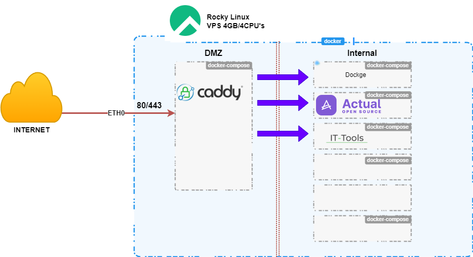

## About The Project

Incorporating [dockge](https://github.com/louislam/dockge), a Docker compose.yaml stack-oriented manager, this project further streamlines the deployment and management of containerized applications. Dockge introduces an intuitive layer for handling Docker Compose files, enabling users to effortlessly create, edit, and manage their service stacks. With Caddy serving as the primary entry point for traffic routing, Dockge complements this setup by offering a centralized platform for managing the underlying Docker Compose configurations. This enhances operational efficiency, simplifies the process of scaling services, and provides a unified interface for overseeing the entire Dockerized environment. The combination of Caddy's reverse proxy capabilities with Dockge's stack management tools presents a robust solution for maintaining a secure, scalable, and well-organized container ecosystem.



# Caddy as a reverse proxy in docker

Caddy will be deployed within a Docker container acting as a reverse proxy, with ports 80 and 443 accessible to the public through DMZ. Its role includes routing traffic to other containers or network devices. Importantly, only this container will be exposed publicly; all other internal communications should occur through Docker Compose's networking capabilities. It's crucial to utilize the `expose` parameter for other containers, ensuring they are only accessible internally within the Docker network.

### - Create a new docker network

`docker network create dmz_net`<br>
`docker network create internal_net`

All the future containers and Caddy must be on `internal_net` network.
  
For internal communication, the project employs a DNS-based strategy by utilizing container names for addressing, allowing containers to target each other using hostnames.

### Create directories that store your stacks and stores Dockge's stack

`mkdir -p /opt/stacks /opt/dockge`


- Files and directory structure

```
/opt/
└── /
    └── stacks/
        └── caddy/
            ├── 🗋 .env
            └── 🗋 docker-compose.yml
/mnt/
└── /
    └── docker-volumes
            ├── caddy
                ├── 🗁 caddy_config/
                ├── 🗁 caddy_data/
                ├── 🗋 Caddyfile
```
* `caddy_config/` - a directory containing configs that Caddy generates,
  most notably `autosave.json` which is a backup of the last loaded config
* `caddy_data/` - a directory storing TLS certificates
* `.env` - a file containing environment variables for docker compose
* `Caddyfile` - Caddy configuration file
* `docker-compose.yml` - a docker compose file, telling docker how to run containers

You only need to provide the three files.<br>
The directories are created by docker compose on the first run, 
the content of these is visible only as root of the docker host.

### - Create docker-compose.yml and .env file

 In this setup, ports 80 and 443 are published/mapped onto the Docker host, as Caddy is designated to handle all incoming traffic on these ports.

[docker-compose.yml](./caddy/docker-compose.yml)

```yml
version: "3.5"
services:
  caddy:
    image: caddy:2.7.6-alpine
    container_name: caddy_dmz
    restart: always
    env_file: .env
    ports:
      - 80:80
      - 443:443
      - 443:443/udp
    volumes:
      - $DOCKER_VOLUME_STORAGE/caddy/Caddyfile:/etc/caddy/Caddyfile
      - $DOCKER_VOLUME_STORAGE/caddy/caddy_data:/data
      - $DOCKER_VOLUME_STORAGE/caddy/caddy_config:/config
      - $DOCKER_VOLUME_STORAGE/caddy/caddy_logs:/var/log/caddy
    logging:
      driver: json-file
      options:
        max-size: 1M
        max-file: "10"
    networks:
      dmz_net:
      default:
networks:
  dmz_net:
    name: $DOCKER_DMZ_NETWORK
    external: true
  default:
    name: $DOCKER_INTERNAL_NETWORK
    external: true
```

[.env](./caddy/.env)

```php
# Docker Volume
DOCKER_VOLUME_STORAGE=/mnt/docker-volumes
# GENERAL
TZ=Asia/Singapore
DOCKER_DMZ_NETWORK=dmz_net
DOCKER_INTERNAL_NETWORK=internal_net
MY_DOMAIN=talz.net
```

You obviously want to change `talz.net` to your domain.

By specifying `DOCKER_VOLUME_STORAGE=/mnt/docker-volumes` in the environment configuration, the project ensures that all containerized applications have a consistent and secure location for storing persistent data.

### - Create Caddyfile in $DOCKER_VOLUME_STORAGE/caddy/Caddyfile

`Caddyfile`

```
stack.{$MY_DOMAIN} {
    reverse_proxy dockge_internal:5001
}

actual.{$MY_DOMAIN} {
    reverse_proxy actual_internal:5006
}


```

For the configuration of subdomains such as `stack` and `actual`, flexibility in naming is provided to suit your naming conventions. To ensure these subdomains are operational, establish type-A DNS records for each. These records must point to your public IP address and be configured within your DNS management platform, such as [Cloudflare](https://www.cloudflare.com/) or any other DNS service provider you utilize.


# Dockge as a Compose manager

- Files and directory structure

```
/opt/
└── /
    └── dockge/
        └── ├── 🗋 .env
            ├── 🗋 compose.yaml
```

[compose.yml](dockge/compose.yaml)

```yml
version: "3.8"
services:
  dockge:
    image: louislam/dockge:1
    restart: unless-stopped
    container_name: dockge_internal
    env_file: .env
    expose:
      - "5001"
    volumes:
      - /var/run/docker.sock:/var/run/docker.sock
      - $DOCKER_VOLUME_STORAGE/dockge/data:/app/data
      - /opt/stacks:/opt/stacks
    environment:
      - DOCKGE_STACKS_DIR=/opt/stacks
networks:
  default:
    name: $DOCKER_INTERNAL_NETWORK
    external: true
```
[.env](dockge/compose.yaml)
```php
# Docker Volume
DOCKER_VOLUME_STORAGE=/mnt/docker-volumes
# GENERAL
TZ=Asia/Singapore
DOCKER_INTERNAL_NETWORK=internal_net
```

### Start the server

`docker compose up -d`

